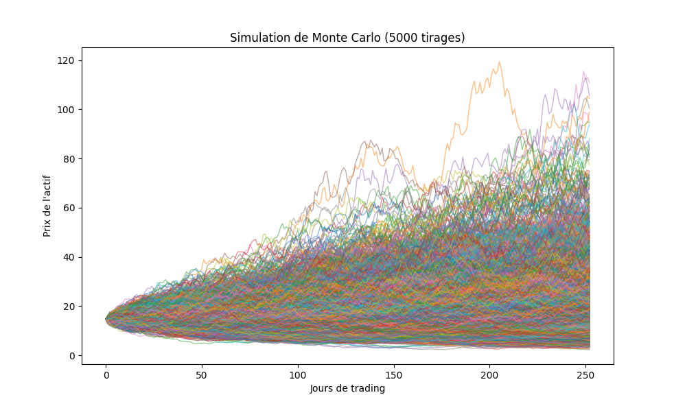
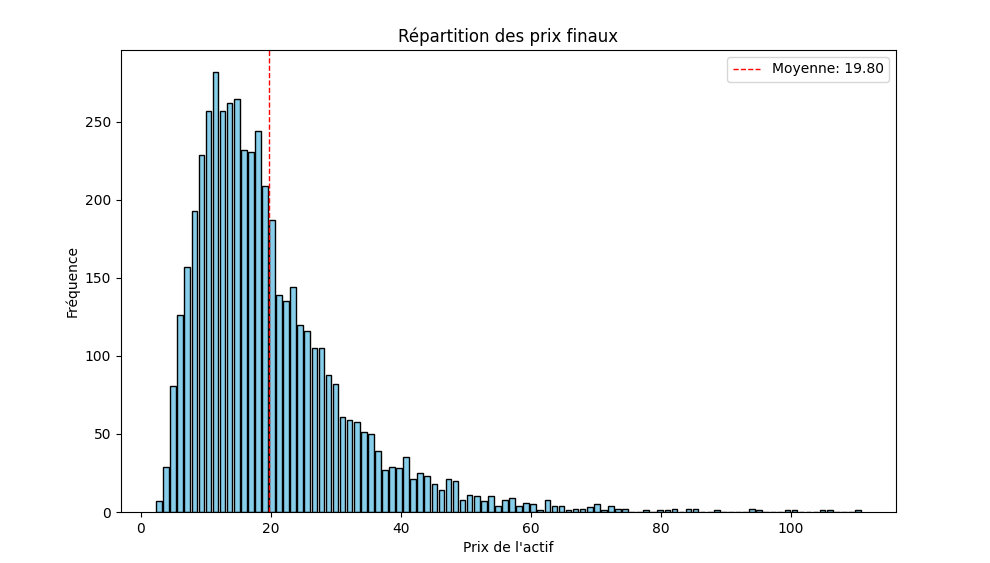

## Overview

This program makes multiple simulations of the future price of our stock based on a Monte Carlo simulation

## Mathematical tools

To calculate the price at each step i have used the formula of a Geometric Brownian Movement :
$$dS_t = \mu S_t dt + \sigma S_t dW_t$$

with,

  * $$S_t$$ the spot depending of the time t,
  * $$\mu$$ the mean expected yield,
  * $$\sigma$$ volatility,

## Results s

Here what we obtain with 5 000 simulations :

